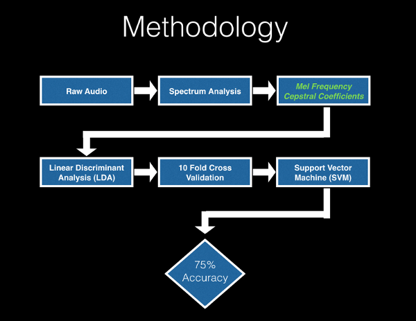
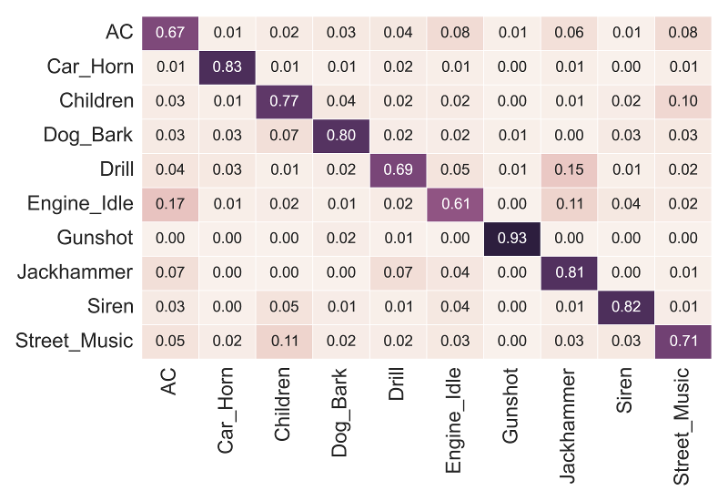

## CitySounds
CitySounds is an environmental sound classifier that uses data science, machine learning, and audio signal processing techniques.  Humans are very good at identifying sounds quickly, how well can a machine do this same task?

[CitySounds Webapp](http://www.citysoundsproject.org)

### Audio Classes (8732 samples)
* Air Conditioner
* Car Horn
* Children Playing
* Dog Bark
* Drilling
* Enginge Idling
* Gun Shot
* Jackhammer
* Siren
* Street Music

### Data Pipeline

### Results

### Packages Used
* Pandas
* Numpy
* Scikit-Learn
* Scipy
* Librosa
* Flask
* Matplotlib
* Seaborn
* SoX (command-line audio processing)
* Aubio

## Credits

Original dataset created by Justin Salamon, Christopher Jacoby, and Juan Pablo Bello

Music and Audio Research Lab (MARL), New York University, USA Center for Urban Science and Progress (CUSP), New York University, USA

* http://serv.cusp.nyu.edu/projects/urbansounddataset
* http://marl.smusic.nyu.edu/
* http://cusp.nyu.edu/

Web app template created by and is maintained by **David Miller**, Managing Parter at [Iron Summit Media Strategies](http://www.ironsummitmedia.com/).

* https://twitter.com/davidmillerskt
* https://github.com/davidtmiller

Start Bootstrap is based on the [Bootstrap](http://getbootstrap.com/) framework created by [Mark Otto](https://twitter.com/mdo) and [Jacob Thorton](https://twitter.com/fat).